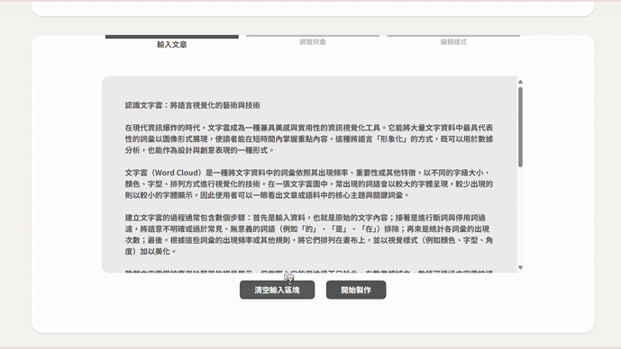
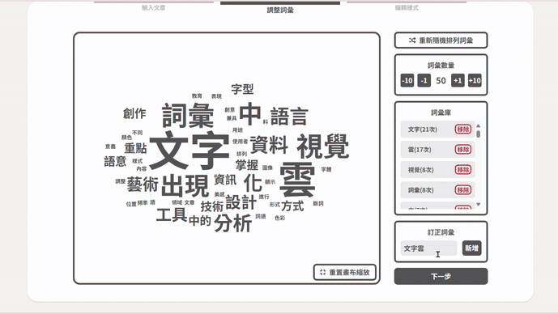
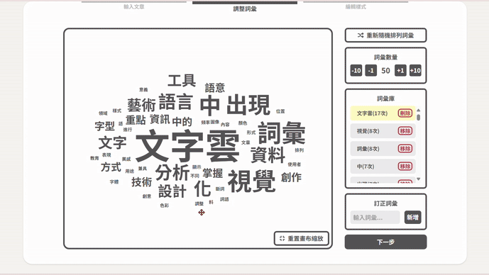
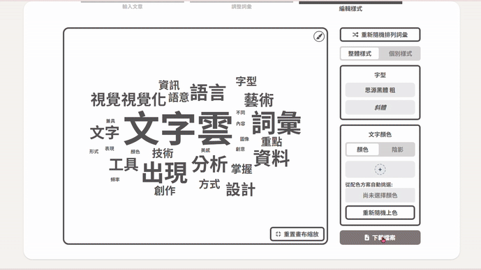
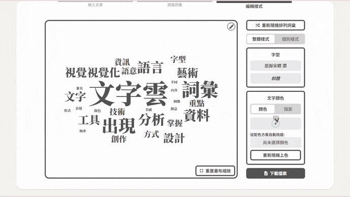
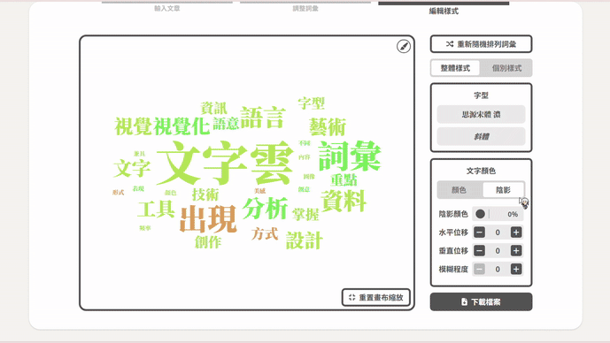
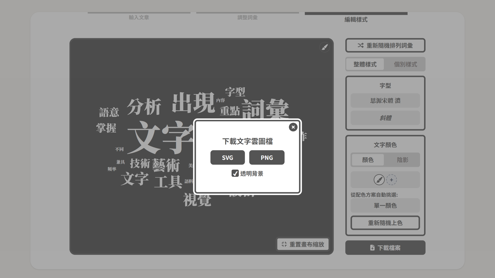
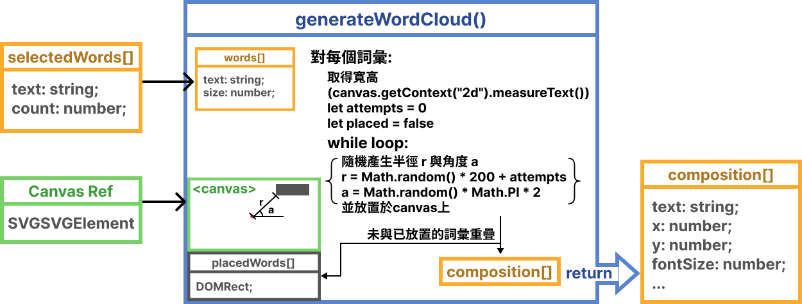

# [製雲](https://make-clouds.vercel.app/)

線上製作精美的繁體中文文字雲。

# 目錄

- [主要功能](#主要功能)
- [技術堆疊](#技術堆疊)
- [技術及功能細節](#技術及功能細節)
  - [核心：Zustand 狀態管理](#核心zustand-狀態管理)
  - [工作區](#工作區)
  - [畫布](#畫布)
- [聯絡我](#聯絡我)

# 主要功能

1. 輸入文章 - 輸入一篇繁體中文文章後，網站會對它進行斷詞、移除停用詞，並計算每個詞彙出現的頻率後，轉換成文字雲：

   

2. 調整詞彙 - 您可以訂正未被正確斷詞的詞彙：

   

   以及移除不想在文字雲中使用的詞彙：

   

3. 編輯樣式 - 變更每個詞彙的字型：

   

   顏色：

   

   以及陰影：

   

4. 下載 - 完成後，將成品以 SVG 或 PNG 檔案的形式下載：

   

# 技術堆疊

前端

- 框架：[React](https://react.dev/), [Next.js](https://nextjs.org/)
- 語言：[TypeScript](https://www.typescriptlang.org/)
- CSS 框架：[Tailwind CSS](https://tailwindcss.com/)
- 狀態管理：[Zustand](https://github.com/pmndrs/zustand)
- 圖示：[Font Awesome](https://fontawesome.com/license/free)
- 第三方套件/API：[react-color](https://github.com/casesandberg/react-color), [clsx](https://github.com/lukeed/clsx), [nanoid](https://github.com/ai/nanoid), [The color API](https://github.com/joshbeckman/thecolorapi)

部屬

- [Vercel](https://vercel.com/)

# 技術及功能細節

## 文字雲生成

在`generateWordCloud()`中：

1. 依出現次數計算每個詞彙的大小（12px-90px）
2. 依輸入的 Canvas Component 大小建立一個`<canvas>`
3. 對每個詞彙：
   1. 使用`canvas.getContext("2d").measureText()`取得精確的寬高
   2. 隨機產生半徑 `r` 以及角度 `a`
   3. 嘗試放在畫布上，若與已放置的詞彙：
   - 有重疊 -> 進行下一次嘗試
   - 沒有重疊 -> 記錄此時的位置，加入已放置的詞彙
   - 有重疊，但已嘗試 1000 次 -> 放棄嘗試，將此詞彙放置於畫布左上角
4. 輸出文字雲結構 `composition[]`

## 核心：Zustand 狀態管理

- 使用`useWordCloudStore()`管理文字雲的所有狀態，以便在任何路徑或組件中取得
- 使用`useCanvasStore()`將一些操作畫布的函式暴露給其他組件使用。
- 針對畫布的 event handler 保留在畫布中，不暴露。

## 工作區

- 重新隨機產生文字雲（`🟦useCanvasStore.triggerRegenerate()`）
- 調整詞彙
  - 調整文字雲中詞彙數量（`🟩useWordCloudStore.selectionCount`）
  - 訂正詞彙（`🟨useWordCloudStore.customWords[]`）
  - 移除詞彙（`🟨useWordCloudStore.removedWords[]`）
- 編輯樣式：整體編輯
  - 字型（`🟥useWordCloudStore.globalFontStyle{}`）
  - 文字顏色（`🟥useWordCloudStore.textColorMap{}`）
  - 文字陰影（`🟥useWordCloudStore.globalTextShadow{}`）
- 編輯樣式：個別編輯
  - 字型（`🟥useWordCloudStore.fontStyleMap{}`）
  - 文字顏色（`🟥useWordCloudStore.textColorMap{}`）
  - 文字陰影（`🟥useWordCloudStore.textShadowMap{}`）

## 畫布

- 根據滑鼠所在位置縮放（`🟦handleWheel()`）
- 拖曳移動詞彙（`🟦handleTextMouseDown()`、`🟦handleMouseMove()`）
- 拖曳移動畫布（`🟦handleCanvasMouseDown()`、`🟦handleMouseMove()`）
- 一鍵重置縮放位置（`🟦resetCanvasPosition()`）
- 改變背景顏色（`🟦useCanvasStore.setCanvasColor()`）
- 與工作區詞彙編輯面板連結（`🟦useCanvasStore.setSelectedWord()`）

# 聯絡我

如有任何問題或建議，歡迎您透過以下方式與我聯絡：

email: [tanni6808450@gmail.com](mailto:tanni6808450@gmail.com)
