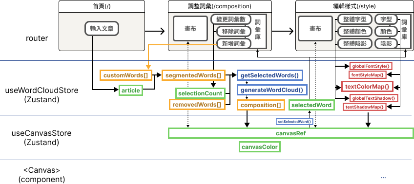

# [製雲](https://make-clouds.vercel.app/)

線上製作精美的繁體中文文字雲。

# 目錄

- [主要功能](#主要功能)
- [技術堆疊](#技術堆疊)
- [技術及功能細節](#技術及功能細節) -[核心：Zustand 狀態管理](#核心zustand-狀態管理) -[工作區](#工作區) -[畫布](#畫布)
- [聯絡我](#聯絡我)

# 主要功能

1. 輸入文章 - 輸入一篇繁體中文文章後，網站會對它進行斷詞、移除停用詞，並計算每個詞彙出現的頻率後，轉換成文字雲：

   

2. 調整詞彙 - 您可以訂正未被正確斷詞的詞彙：

   

   以及移除不想在文字雲中使用的詞彙：

   

3. 編輯樣式 - 變更每個詞彙的字型：

   

   顏色：

   

   以及陰影：

   

4. 下載 - 完成後，將成品以 SVG 或 PNG 檔案的形式下載：

   

# 技術堆疊

前端

- 框架：[React](https://react.dev/), [Next.js](https://nextjs.org/)
- 語言：[TypeScript](https://www.typescriptlang.org/)
- CSS 框架：[Tailwind CSS](https://tailwindcss.com/)
- 狀態管理：[Zustand](https://github.com/pmndrs/zustand)
- 圖示: [Font Awesome](https://fontawesome.com/license/free)
- 第三方套件/API: [react-color](https://github.com/casesandberg/react-color), [clsx](https://github.com/lukeed/clsx), [nanoid](https://github.com/ai/nanoid), [The color API](https://github.com/joshbeckman/thecolorapi)

部屬

- [Vercel](https://vercel.com/)

# 技術及功能細節

## 核心：Zustand 狀態管理

## 工作區

- 重新隨機產生文字雲（<code style="color: blue">triggerRegenerate()</code>）
- 調整詞彙
  - 調整文字雲中詞彙數量（``）
  - 訂正或移除詞彙（``）
- 編輯樣式：整體編輯
  - 字型（``）
  - 文字顏色（``）
  - 文字陰影（``）
- 編輯樣式：個別編輯
  - 字型（``）
  - 文字顏色（``）
  - 文字陰影（``）

## 畫布

- 根據滑鼠所在位置縮放（）
- 拖曳移動詞彙（）
- 一鍵重置縮放位置（）
- 改變背景顏色（）
- 與工作區詞彙編輯面板連結（）

# 聯絡我

如有任何問題或建議，歡迎您透過以下方式與我聯絡：

email: [tanni6808450@gmail.com](mailto:tanni6808450@gmail.com)
